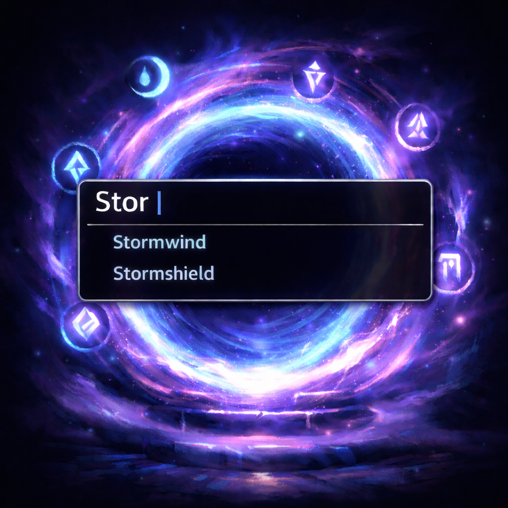
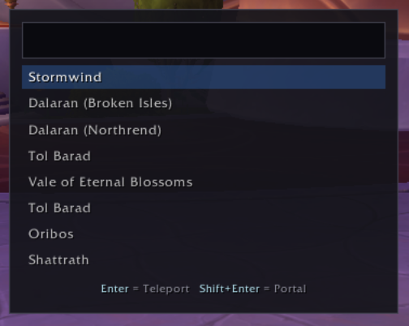

# QuickPort

A command palette for mage teleport and portal spells. Press **Ctrl+P** to open a searchable popup, type to filter destinations, then press **Enter** to teleport or **Shift+Enter** to open a portal.

## Features

- Fuzzy search across all mage teleport and portal destinations
- Press Enter to cast the teleport, Shift+Enter for the portal
- Arrow keys to navigate results
- ESC to close
- Auto-hides on combat entry
- Mage-only — silently disables for other classes

## Usage

| Action | Key |
|--------|-----|
| Open / toggle palette | Ctrl+P (rebindable) |
| Filter | Type to search |
| Navigate results | ↑ / ↓ |
| Teleport | Enter |
| Open portal | Shift+Enter |
| Close | ESC |

You can also use `/quickport` or `/qp` to toggle the palette.

## License

GPL v3 — see [LICENSE](LICENSE).
